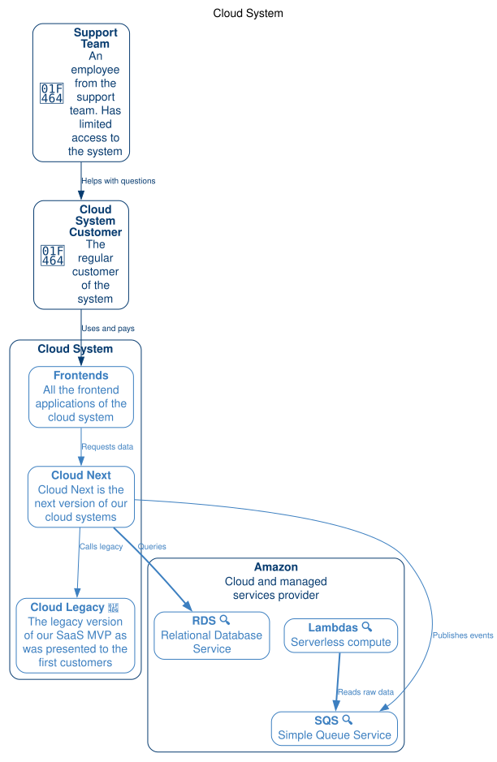
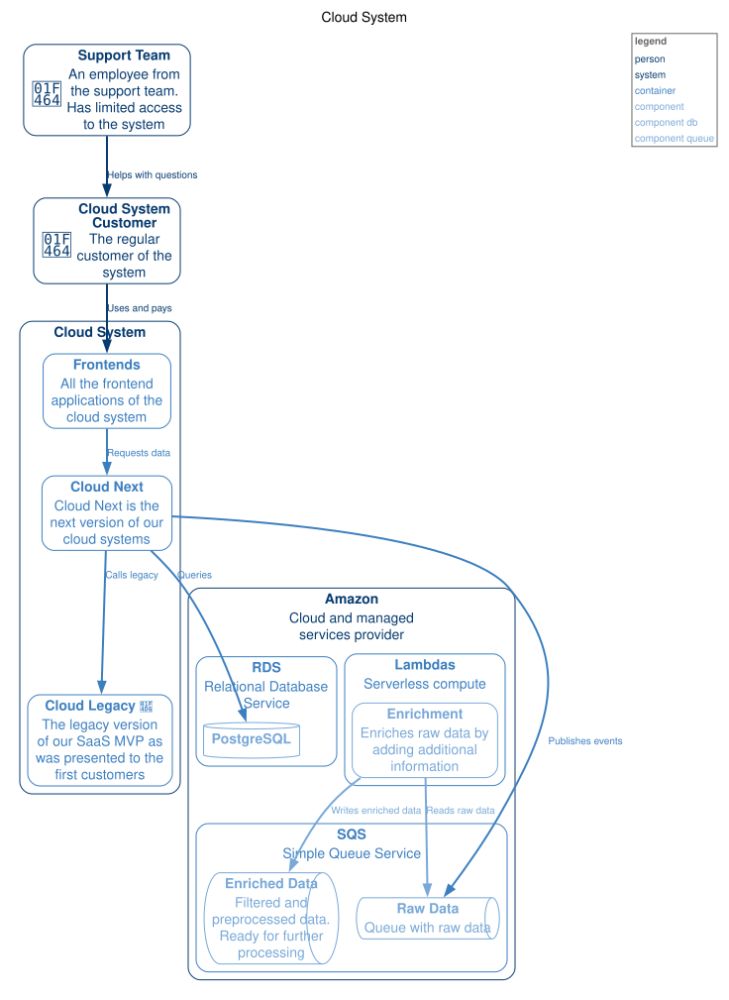
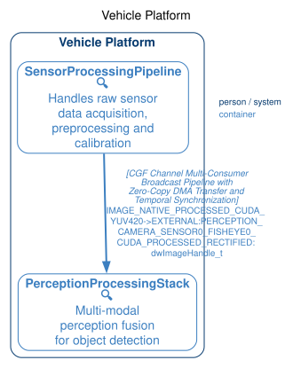
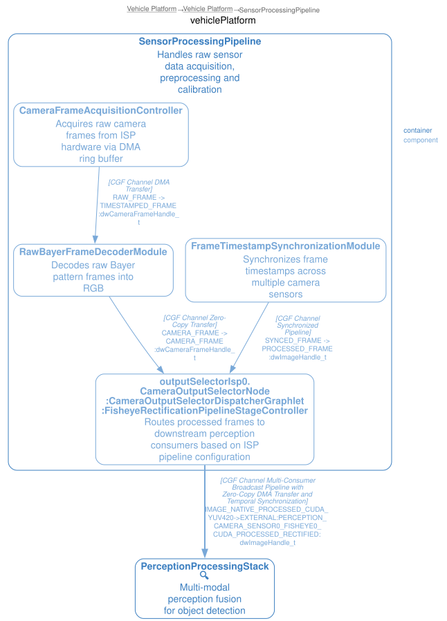
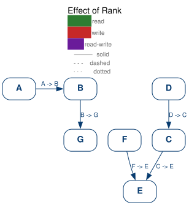

= C4Drill image:https://pkg.go.dev/badge/github.com/Djarvur/c4drill.svg["GoDoc",link="https://pkg.go.dev/github.com/Djarvur/c4drill"] image:https://github.com/Djarvur/c4drill/actions/workflows/pr-sanity.yml/badge.svg["Build Status",link="https://github.com/Djarvur/c4drill/actions/workflows/pr-sanity.yml"] image:https://coveralls.io/repos/github/Djarvur/c4drill/badge.svg?branch=master&service=github["Coverage Status",link="https://coveralls.io/github/Djarvur/c4drill?branch=master"]
:toc:
:toc-title: Contents
:icons: font

Describe your architecture once in a TOML file; C4Drill generates a
hierarchy of cross-linked C1/C2/C3 SVG diagrams with automatic drill-down
navigation. The model is the diagram: edit the TOML, re-run the tool,
and every level plus all navigation links is regenerated consistently.
No runtime, no GUI, no manual drawing. Author in TOML or in the compact
C4D brace format — the same model, the same pipeline (see <<C4D Format>>).

== What It Is and What Problem It Solves

One TOML model produces the C1 context diagram below, the C2 container
diagrams, the C3 component diagrams, and every drill-down link between
them. Open any generated SVG to click through.

Real systems do not fit one sheet: dozens to hundreds of elements on a
single diagram are unreadable, and hand-maintaining a linked C1 → C2 →
C3 hierarchy drifts out of sync with the code. C4Drill generates the
hierarchy from the model, so every level and all navigation links stay
consistent after each re-run.

=== Why Not an Existing Tool?

[cols="1,2,2",options="header",]
|===
|Tool |Good at |But
|PlantUML (+ C4 module) |Rich syntax, Markdown integration |No enforced C4 levels; every level is a separate hand-written diagram — the drill-down hierarchy is not generated
|Mermaid |Diagrams straight from Markdown (GitHub, Obsidian) |Flat pictures: no C4 model, no levels, no zoom-in navigation
|Structurizr DSL |Purpose-built C4 modeling language |More general than the task — a modeling platform with workspaces; C4Drill is deliberately minimal and strict
|LikeC4 |The closest: model + nested views with drill-down |Requires a runtime/workspace; C4Drill emits static files you can commit and open anywhere
|===

C4Drill targets the *static-artifact* case: diagrams that live in the
repository, are reviewed in pull requests, and render everywhere.

=== Why TOML?

No new DSL to learn. TOML is a configuration format most engineers
already read, and the schema *is* the C4 model: `type = "container"` and
`name = "API Service"` read like prose. A bespoke DSL (or HCL) would add
syntax to learn without adding modeling power. C4Drill additionally
ships C4D, a second authoring format with the same modeling power and
no TOML boilerplate — a compact brace-block notation for multi-level
diagrams (see <<C4D Format>>); pick per file, convert freely.

=== Is This for You?

* *Yes*, if you want the level hierarchy generated and kept in sync as
  versionable static files.
* *Probably not*, if you only need quick throwaway diagrams inside
  Markdown — Mermaid or PlantUML will serve you better.

== Install

[source,bash]
----
go install github.com/Djarvur/c4drill/cmd/c4drill@latest
----

Or build from source:

[source,bash]
----
git clone https://github.com/Djarvur/c4drill
cd c4drill
go build -o c4drill ./cmd/c4drill
----

== Quick Start

[source,bash]
----
# Generate SVG diagrams (default)
c4drill architecture.toml

# Generate to specific directory
c4drill architecture.toml -o ./docs/diagrams

# Generate DOT format for customization
c4drill architecture.toml -f dot -o ./output
----

Both authoring formats are interchangeable throughout: pass a
`architecture.c4d` file (see <<C4D Format>>) to any command shown here.

== Examples

The models below are adapted from the
https://github.com/likec4/likec4/tree/main/examples[likec4 examples].
Generated diagrams are committed next to their TOML sources, so what you
see here is exactly what `c4drill` produces. Features likec4 has that
C4Drill does not (dynamic and deployment views, tags, metadata,
view-local styles) are either mapped to the closest C4Drill equivalent
or dropped with a note in the source file.

=== Cloud System

A SaaS platform with two external parties and multi-level drill-down.

The C1 diagram already shows one nesting level; clicking the nodes
drills down further:

* link:examples/cloud-system/cloud-system/cloud.svg[Cloud System — C2 containers]
* link:examples/cloud-system/cloud-system/amazon.svg[Amazon — C2 containers]
* link:examples/cloud-system/cloud-system/amazon/rds.svg[RDS — C3 (PostgreSQL)]
* link:examples/cloud-system/cloud-system/amazon/sqs.svg[SQS — C3 (queues)]
* link:examples/cloud-system/cloud-system/amazon/lambdas.svg[Lambdas — C3 (enrichment)]

Regenerate:

[source,bash]
----
c4drill examples/cloud-system/cloud-system.toml
c4drill examples/cloud-system/cloud-system.toml --expanded
----

==== All-Expanded Diagram

`--expanded` renders every unit on a single diagram — no drill-down
navigation, useful for a one-shot review of the whole architecture:

=== Vehicle Platform

A stress test: very long display names and channel-technology labels.
C4Drill sizes labels from their content — tune the shape with
`--label-ratio` (default 1.6) or the `C4DRILL_LABEL_RATIO` environment
variable.

The longest labels live in the sensor processing pipeline (C3):

Parallel edges between the same pair of units collapse to a single
thicker edge in resolved views (first-wins dedup, D-01); the
`--expanded` diagram shows every parallel link with its own label.

Regenerate:

[source,bash]
----
c4drill examples/overflow-test/overflow-test.toml
----

=== Effect of Rank

The per-link `rank` attribute controls layout direction per edge:

- `rank = "forward"` (default) — the target ranks after the source.
- `rank = "equal"` — both endpoints share a rank.
- `rank = "reverse"` (v1.13) — **flips the vertical ordering with one option
  while the arrow still points at the target.** This replaces the old
  two-part idiom of authoring the link as `"<-"` plus `arrow = "reverse"`
  (the old idiom still works, but `rank = "reverse"` is the clear way to
  express it).

A minimal graph showing rank hints: `D` carries a link to `C` to satisfy
the orphan rule (see <<Validation Rules>>).

Regenerate:

[source,bash]
----
c4drill examples/rank-for-better-layout/rank-for-better-layout.toml
----

== TOML Format

=== Minimal Example

[source,toml]
----
[properties]
name = "My System"

[user]
type = "person"
name = "User"

[webapp]
type = "system"
name = "Web Application"

# Every unit needs at least one link (orphan rule)
[[webapp.link]]
peer = "user"
description = "Uses"
----

=== Properties Section

The `++[++properties++]++` section defines global settings for your
architecture:

[source,toml]
----
[properties]
name = "E-Commerce Platform"        # Required: Architecture name
description = "Online store system" # Optional: Description
color = "#E3F2FD"                   # Optional: Default background color
style = "filled"                    # Optional: Default visual style
border = "#1565C0"                  # Optional: Default border color
edges = "spline"                    # Optional: Edge routing (straight|spline|square|ortho)
lineLength = 40                     # Optional: Max line length before wrap (0=auto)
expanded = ["payments"]             # Optional: Units to expand by default
legend = true                       # Optional: Legend in the upper-right (default: on)
----

The `edges` routing value applies to **every** generated diagram (C1, C2,
C3, expanded); `square` is an alias for ortho routing. A unit-level `edges`
field overrides the global value for that unit's own diagram. Either value
can be overridden per *invocation* with the `--edges` CLI flag (see
<<CLI Reference>>) — no model edit needed.

=== Edge Kinds and the Legend

Links accept a `kind` attribute that colours the edge by data flow — no
explicit `color` needed:

[cols="2,3"]
|===
|Kind |Edge colour

|`read`
|green `#2E7D32`

|`write`
|red `#C62828`

|`read-write`
|purple `#6A1B9A` (hue-distinct from both; a literal blend would be illegible)
|===

An explicit `color` overrides the kind colour (the kind still documents the
data flow). Unknown kinds render with the default edge colour.

**Collapsed edges keep their kind identity** (v1.13): when several links
collapse to a visible ancestor, the collapsed edge's colour derives from the
constituents — all-read green, all-write red, mixed purple. Its line style
follows precedence: all constituents agree → that style; otherwise any solid
→ solid, else any dashed → dashed, else dotted. If any constituent carries a
custom `color`, kind colouring is suppressed and the default edge colour is
used.

**Legend** (default: on) — every diagram renders a legend in the upper-right
listing the three kind colours and the line-style samples, followed by
author-defined rows:

[source,toml]
----
[properties]
legend = false                      # Disable the legend model-wide

[[properties.legendLine]]
label = "Nightly batch"
color = "#E65100"
style = "dashed"
----

In the C4D format, `legend: false` disables the legend and custom lines are
pipe-split list items (`"label|color|style"`; the label cannot contain a
pipe):

[source,c4d]
----
properties {
  legendLine: ["Nightly batch|#E65100|dashed"]
}
----

=== Unit Types

Each unit is defined as a TOML section. The section name becomes the
unit's identifier.

*Type is optional* — defaults based on nesting level:

* Root-level units → `system`
* Units inside system/box → `container`
* Units inside container → `component`

==== Person (Actor)

[source,toml]
----
[user]
type = "person"                     # Required
name = "Customer"                   # Optional: defaults to humanized identifier
description = "Online shopper"      # Optional
----

==== External Person (External Actor)

An actor outside the organization (partner, regulator, third-party
user). Same fields as `person`:

[source,toml]
----
[auditor]
type = "personExternal"
name = "Compliance Auditor"
description = "External regulatory auditor"
----

==== System

[source,toml]
----
[webapp]
type = "system"
name = "Web Application"
description = "Frontend web app"
technology = "React, TypeScript"    # Optional: Shown in diagram
----

==== External System

[source,toml]
----
[stripe]
type = "systemExternal"
name = "Stripe"
description = "Payment processor"
----

==== Database

[source,toml]
----
[postgres]
type = "db"
name = "PostgreSQL"
description = "Primary database"
technology = "PostgreSQL 15"
----

==== External Database

[source,toml]
----
[analytics]
type = "dbExternal"
name = "Analytics DB"
description = "Third-party analytics"
----

==== Queue

[source,toml]
----
[rabbitmq]
type = "queue"
name = "Message Queue"
description = "Async job processing"
technology = "RabbitMQ"
----

==== External Queue

[source,toml]
----
[sqs]
type = "queueExternal"
name = "AWS SQS"
description = "External message queue"
----

==== Box (Grouping Container)

[source,toml]
----
[cloud]
type = "box"
name = "AWS Cloud"
description = "Cloud infrastructure"
----

`box` is a *universal shorthand*: write it at any nesting depth and it
promotes to the level-appropriate variant (`containerBox` at C2,
`componentBox` at C3); at C1 (root or inside another `box`) it stays
`box`. See <<_optional_type_inference>> below.

==== Reference (External Documentation URL)

Any unit accepts an optional `reference` field — an external
documentation URL. When set, a 📖 marker appears next to the unit name
and the node becomes clickable (GraphViz's native `URL` attribute in
SVG). In `-f html` output, external `http(s)` references open in a new
tab, distinct from internal drill-down navigation.

[source,toml]
----
[api]
type = "system"
name = "API Service"
reference = "https://wiki.example.com/api-runbook"   # Optional: 📖 marker, clickable
----

An empty string and an omitted field are equivalent (no 📖, not
clickable).

=== Optional Name (Humanization)

The `name` field is *optional*. When omitted, the display name is
derived from the *last segment* of the unit's identifier via a dumb
camelCase split:

[source,toml]
----
# Explicit name (always wins — use this for acronyms or custom labels)
[linuxSystem.localIDP]
name = "My Custom Name"

# Name omitted — humanized from the last path segment "sessionManager"
[linuxSystem.sessionManager]
# displays as "Session Manager"
----

*Humanization rules:*

* Splits camelCase boundaries and Title-cases each word.
* Operates on the *last path segment only* —
`++[++linuxSystem.localIDP++]++` becomes "Local IDP", not "Linux System
Local IDP".
* Examples: `sessionManager` → "Session Manager", `localIDP` → "Local
IDP", `linuxSystem` → "Linux System".

*Acronyms:* acronym preservation is *not* supported — `gRPC` humanizes
to "Grpc". Set `name =` explicitly to override; an explicit `name =`
always wins.

*Backward compatibility:* models that set `name =` on every unit are
unaffected — humanization only fires when `name` is omitted.

=== Optional Type (Inference)

The `type` field is *optional*. When omitted, the type is inferred from
the parent unit's type. The generic types — `db`/`queue` and the
grouping `box` — are also promoted to the level-specific variant based
on nesting. Three rules apply:

*1. Default type by parent* — the type assigned when `type` is omitted
entirely:

[cols=",,",options="header",]
|===
|Parent type |Inferred child type |Level
|(none — root) |`system` |C1
|`system` |`container` |C2
|`box` |`system` |C1 (same-level grouping)
|`container` |`component` |C3
|`containerBox` |`container` |C2 (same-level grouping)
|`componentBox` |`component` |C3 (same-level grouping)
|(other: db, queue, etc.) |`system` |C1 fallback
|===

*2. Generic `db`/`queue` promotion* — when `type = "db"` or
`type = "queue"` is set explicitly, the type is promoted to the
level-specific variant based on the parent:

[cols=",,,",options="header",]
|===
|Parent type |`db` becomes |`queue` becomes |Level
|(none) or `box` |`db` |`queue` |C1 (unchanged)
|`system` or `containerBox` |`containerDb` |`containerQueue` |C2
|`container` or `componentBox` |`componentDb` |`componentQueue` |C3
|===

*3. `box` promotion* — `type = "box"` is valid at any depth and promotes
to the level-appropriate grouping variant based on the parent:

[cols=",,",options="header",]
|===
|Parent type |`box` becomes |Level
|(none) or `box` |`box` |C1 (unchanged — same-level grouping)
|`system` or `containerBox` |`containerBox` |C2
|`container` or `componentBox` |`componentBox` |C3
|===

Once promoted, the box's children follow the level-specific default
(`container` under `containerBox`, `component` under `componentBox`).

*Before/after example:*

[source,toml]
----
# BEFORE — explicit types (verbose)
[platform]
type = "system"
[platform.webapp]
type = "container"
[platform.webapp.cache]
type = "componentDb"     # generic db promoted because parent is container

# AFTER — type omitted, inferred (identical result)
[platform]
# type omitted → inferred "system" (no parent)
[platform.webapp]
# type omitted → inferred "container" (parent is system)
[platform.webapp.cache]
type = "db"
# explicit generic db → promoted to "componentDb" (parent is container)

# box shorthand anywhere — promoted to "containerBox"; children default to container
[platform.group]
type = "box"
[platform.group.svc]
# type omitted → inferred "container" (parent promoted to containerBox)
----

An explicit non-generic `type =` always wins (no inference runs). The
explicit variants `containerBox` and `componentBox` are themselves
non-generic, so they pass through unchanged — use them only to pin the
level regardless of position.
Source: `defaultTypeForParent` and `inferGenericType` in
`internal/parser/parser.go`.

=== Nesting (C2/C3 Diagrams)

Systems and boxes can contain subunits using dotted notation:

[source,toml]
----
[mainapp]                    # C1 level
type = "system"
name = "Main Application"

[mainapp.api]                # C2 level (container)
type = "container"
name = "API Service"

[mainapp.webapp]             # C2 level (container)
type = "container"
name = "Web App"

[mainapp.api.handlers]       # C3 level (component)
type = "component"
name = "HTTP Handlers"

[mainapp.api.services]       # C3 level (component)
type = "component"
name = "Business Services"
----

=== Nesting Context in Rendered Diagrams

Diagrams keep container context — elements never float free of their
hierarchy (v1.21):

* *Full ancestor chains* — every element depicted on a non-expanded view
  renders inside its complete ancestor-container chain. If a view shows a
  component three levels deep, the viewer sees it nested in its parent
  container inside its parent system, not as a flat top-level node.
* *Deep links keep their target* — a link aimed at a deeply nested unit
  terminates at the true target *inside* its ancestor chain, not at a
  collapsed stand-in at the top level.
* *Expanded units show nested clusters* — an expanded unit renders its
  nested containers as clusters (with the 🔍 drill-down marker and
  explore link), not as a flat list of names.

==== Ancestor Wrapping (v1.22)

v1.22 reverses one v1.21 boundary: every node a view depicts — regular,
boundary, or expanded — now renders *inside its full ancestor-container
chain*, not at the top level. When the depicted element's ancestors are
not otherwise part of the view, the generator synthesises wrapper
clusters for them, labelled with the container's pretty name. Wrappers
are pure structure: they carry no 🔍 drill-down glyph and no explore
link, and they exist only where an element in the view needs them.

The one remaining top-level rule: units *fully external* to the depicted
subtree — with no ancestor relationship to anything shown — still render
at the top level. Collapsed subtrees are likewise not restructured;
chains unfold only for the elements a view actually depicts.

See `skill/examples/11-nesting-context.toml` for a runnable three-level
example with a deep-link target and an expanded unit containing a
container, and `skill/examples/13-wrapping.toml` for boundary and
sibling entries rendered inside their ancestor chains.

=== Links (Relationships)

Define relationships between units using `[[link]]` (outgoing) or
`[[linkFrom]]` (incoming). Define each relationship exactly once — the
two forms are just different places to write the same edge:

[source,toml]
----
[user]
type = "person"
name = "User"

[webapp]
type = "system"
name = "Web Application"

# Outgoing link: User → Webapp (defined on the source)
[[webapp.link]]
peer = "user"
technology = "HTTPS"
description = "Browses"

[api]
type = "system"
name = "API Service"

# Incoming link: Webapp → API (defined on the target)
[[api.linkFrom]]
peer = "webapp"
technology = "REST/JSON"
description = "Calls"
----

==== Link Attributes

[cols=",,",options="header",]
|===
|Attribute |Description |Example
|`peer` |Target unit identifier (required) |`"user"`, `"platform.api"`
|`technology` |Protocol/technology label |`"HTTPS"`, `"gRPC"`, `"TCP"`
|`description` |Relationship description |`"Sends events to"`
|`arrow` |Arrow direction |`"forward"`, `"reverse"`, `"bidirectional"`, `"none"`
|`rank` |Layout ranking hint: `"reverse"` flips the vertical ordering while keeping the arrow direction (v1.13) |`"forward"`, `"reverse"`, `"equal"`
|`kind` |Data-flow kind colouring (v1.13): read=green `#2E7D32`, write=red `#C62828`, read-write=purple `#6A1B9A`; explicit `color` wins |`"read"`, `"write"`, `"read-write"`
|`color` |Edge color (overrides kind) |`"blue"`, `"++#++FF5733"`
|`style` |Line style |`"solid"`, `"dashed"`, `"dotted"`
|`labelPosition` |Where the label appears |`"middle"`, `"tail"`, `"head"`
|===

==== Multiple Links

[source,toml]
----
[api]
type = "system"
name = "API"

[[api.link]]
peer = "user"
technology = "HTTPS"
description = "Authenticates"

[[api.link]]
peer = "webapp"
technology = "REST"
description = "Serves data"
----

*Parallel edges:* when several links connect the same pair of units,
resolved views collapse them into a single thicker edge (the first one
wins); the `--expanded` diagram shows every parallel link separately.

=== Expanded Units (Drill-Down)

Mark units as "expanded" to generate C2/C3 diagrams for them:

[source,toml]
----
[properties]
name = "My System"
expanded = ["mainapp"]        # Generate C2 for mainapp

[mainapp]
type = "system"
name = "Main Application"
expanded = ["mainapp.api"]    # Generate C3 for mainapp.api

[mainapp.api]
type = "container"
name = "API Service"

[mainapp.api.handlers]
type = "component"
name = "Handlers"

[mainapp.api.services]
type = "component"
name = "Services"

[[mainapp.api.handlers.link]]
peer = "mainapp.api.services"
description = "Calls"
----

*Output structure:*

[source,text]
----
output/
├── architecture.svg           # C1 diagram
├── architecture/              # C2 diagrams directory
│   └── mainapp.svg            # C2 for mainapp
│   └── mainapp/               # C3 diagrams directory
│       └── api.svg            # C3 for mainapp.api
----

=== Styling

Override default colors and styles per unit:

[source,toml]
----
[webapp]
type = "system"
name = "Web Application"
color = "#4A90D9"              # Background color
border = "#2E5A8B"             # Border color
style = "solid"                # Border style (solid|dashed|dotted)
edges = "spline"               # Edge routing for this unit's links
width = 300                    # Explicit label width (0=auto)
height = 200                   # Explicit label height (0=auto)
----

`width` and `height` are rarely needed — labels are normally sized
from their content (see `--label-ratio` in the CLI Reference).

Since v1.13 the unit styling triple actually renders: `color` fills the node
(or the expanded-unit cluster) — a dark fill forces a white label for
legibility — `border` sets the border colour, and `style` sets the border
style (`solid`, `dashed`, or `dotted`). Author styling beats the automatic
box-content heuristic. Units without these fields keep the C4 type palette.

=== Templates

A template is a `++[++template.++<++name++>++]++` table that declares
parameters and a unit shape (including subunits and links); each
`++[[++use++]]++` directive instantiates it with concrete values.

[source,toml]
----
[template.microservice]
params = ["name", "tech", "upstreamBus"]
name = "${name} Service"
type = "container"
technology = "${tech}"
description = "${name} handles its domain"
reference = "https://wiki.example.com/${name}"

[[template.microservice.link]]
peer = "${upstreamBus}"
description = "Publishes ${name} domain events"

[[use]]
template = "microservice"
parent = "platform"
name = "auth"
tech = "Go, gRPC"
upstreamBus = "messageBus"
----

*Rules:*

* All declared params are *required* on every `++[[++use++]]++` (no
defaults); a missing param is a hard error.
* `$++{++param}` substitutes into every string field — name,
description, technology, reference, color, and link fields (peer,
description, technology).
* The link set is *fixed*: a template with one
`++[[++template.X.link++]]++` produces exactly one link per
instantiation (no fan-out / `for++_++each`).
* Subunit subtrees are supported (declare `++[++template.X.child++]++`);
the subunit key is verbatim, only field values are substituted.
* Duplicate unit paths across instantiations are a hard error.

See `skill/examples/06-templates.toml` for a runnable example.

=== Multi-File Composition (Include)

Assemble a diagram from multiple TOML files. Each `++[[++include++]]++`
directive pulls in another file relative to the including file's
directory and merges its units into the model.

[source,toml]
----
# entry.toml
[platform]
type = "system"
name = "Platform"

[[include]]
path = "auth.toml"

[[include]]
path = "templates.toml"
once = true
----

*Rules:*

* Paths are *relative to the including file's directory* (not the CLI
cwd).
* Includes are *transitive* (an included file may itself include
others).
* `once = true` deduplicates by canonical path — a file included again
(even via a different path) is skipped.
* The merge is *flat* (no namespacing): included units append in include
order. Cross-file subunits are supported — an included file may
re-declare a parent declared in the entry and contribute subunits under
it.
* Include cycles are a fatal error; missing files are a hard error.
* Properties follow root-file-wins (the entry's `++[++properties++]++`
takes precedence).

See `skill/examples/08-include/` for a runnable multi-file example.

=== Relative Peer Resolution

A bare `peer` value (no dot) resolves against the enclosing parent's
ancestor scopes — walking up nearest-first until a sibling match is
found. A peer *with a dot* is absolute and used as-is.

[source,toml]
----
[platform.api]
# Bare peer "cache" resolves via walk-up:
[[platform.api.link]]
peer = "cache"                          # sibling: platform.cache (nearest ancestor scope match)

[[platform.api.link]]
peer = "platform.cache"                 # absolute: has a dot, used as-is
----

*The four resolution cases:*

* *Sibling match* — the nearest ancestor scope (the immediate parent)
has a child with that name.
* *Aunt/grandparent match* — walk up past the parent; a grandparent's
child matches.
* *Root match* — walk all the way to the top-level scope.
* *Absolute fallback* — a peer containing a dot is never walked-up; it
is used verbatim.

Multiple matches at the same depth are impossible (sibling keys are
unique per parent). A miss at root is a hard error naming the peer and
the host unit.

See `skill/examples/07-relative-peer.toml` for a runnable example
demonstrating all four cases.

== C4D Format

C4D (`.c4d`) is a second authoring format for the same model: a
brace-block format that is less verbose than TOML for multi-level
diagrams. Everything the TOML format expresses — units, links,
templates, includes, styling — has a C4D equivalent. `c4drill`
renders `.c4d` files directly through the full pipeline, `c4drill
convert` translates between the two formats (canonical-equivalent
round-trip), and `c4drill fmt` formats both.

TIP: Prefer C4D when a diagram has deep nesting or many links: edges
live inside the unit they belong to, and one-line leaf blocks keep
files compact. Stay with TOML when the file is machine-generated or
edited by tooling that already speaks TOML.

=== Minimal Example

[source,c4d]
----
properties {
  name: My System
}

user: person "User" { }

webapp: system "Web Application" {
  -> user: Uses
}
----

=== Units and Nesting

A unit is a header plus a brace block:

    id: type "Display Name" { body }

* `id` — the unit identifier (letters, digits, `_`, `-`).
* `type` — *optional*; an omitted type infers exactly as in TOML (see
  <<_optional_type_inference>>). Type keywords are the exact TOML type
  names (`system`, `person`, `db`, `queue`, `box`, `container`,
  `component`, `containerDb`, `componentQueue`, ...). External units
  take the `external` modifier after the type: `system external`,
  `person external`, `db external`.
* `"Display Name"` — *optional*; an omitted name humanizes from the id
  exactly as in TOML.

Nested units are brace blocks inside the parent:

[source,c4d]
----
shop: system "E-Commerce Platform" {
  webapp: container "Web Application" { technology: "React, TypeScript" }
  database: containerDb "Database" { technology: PostgreSQL }
}
----

The brace block is required even when empty (`x: system { }`). The
generic `db`/`queue`/`box` types promote by nesting level exactly as in
TOML — `database` above is a `containerDb` because its parent is a
system.

=== Fields

Field statements inside a block mirror the TOML unit fields — one
`field: value` per line:

[source,c4d]
----
api: system "API Service" {
  description: "Backend API"
  technology: "Go"
  reference: https://wiki.example.com/api-runbook
  color: "#E3F2FD"
  border: "#1565C0"
}
----

The `properties { }` block carries the same keys as
`++[++properties++]++` in TOML (`name`, `description`, `color`,
`style`, `border`, `edges`, `lineLength`, `expanded`).

=== Literals and Comments

* Barewords are fine when unambiguous: `technology: PostgreSQL`. Quote
  with double quotes when the value contains `{ }`, `:`, `|`, a comma
  or edge whitespace: `technology: "React, TypeScript"`.
* Multi-line strings use triple quotes:

[source,c4d]
----
description: """Line one
line two"""
----

* URLs with a scheme prefix are valid barewords (`reference:
  https://wiki.example.com/api` above).
* `#` starts a line comment; comments are preserved by `c4drill fmt`.
* List values accept the inline form (`expanded: [platform, webapp]`)
  or one item per line:

[source,c4d]
----
expanded: [
  platform
  webapp
]
----

=== Edges

Edges live *inside unit blocks only* — never at the top level. Four
ASCII arrows:

[cols="1,3",options="header",]
|===
|Arrow |Meaning
|`-> peer` |Outgoing link (`++[[++link++]]++` in TOML)
|`<- peer` |Incoming link — the edge is declared on the target (`++[[++linkFrom++]]++` in TOML)
|`<-> peer` |Bidirectional
|`-- peer` |No arrowhead
|===

The label shorthand is `-> peer: "tech | description"`. A single
un-piped value is the *description*:

[source,c4d]
----
-> db: queries orders        # description only
-> db: sql |                 # technology only
-> db: sql | queries orders  # both
----

Link attributes ride a trailing brace block on the edge statement:

[source,c4d]
----
-> payment: "HTTPS | Processes payments" { rank: equal kind: write color: orange style: solid }
----

`kind: read | write | read-write` colours the edge (green / red / purple);
`rank: reverse` flips the layout ranking while the arrow still points at the
target — the single-knob replacement for the `<-` + `arrow: reverse` pair.
The upper-right legend is on by default; `legend: false` in the properties
block disables it and `legendLine: ["label|color|style"]` appends custom rows
(see <<Edge Kinds and the Legend>>).

Note: `kind` is an enum-like field and is *not* substituted by template
`${param}` parameters (the same rule as `arrow`/`rank`); other link fields
substitute normally.

Peer targets use the same relative-peer semantics as TOML: a bare name
resolves against the enclosing parent's ancestry walking up
nearest-first; a dotted path is absolute (see
<<_relative_peer_resolution>>). Two edges to the same peer in one
block are a hard error.

=== Templates and use

Templates are function-like declarations; `use` instantiates them.
`${param}` substitution, the all-params-required rule and the fixed
link set are identical to TOML templates (see <<Templates>>):

[source,c4d]
----
template microservice(name, tech, upstreamBus) {
  type: container
  name: "${name} Service"
  technology: "${tech}"
  -> ${upstreamBus}: "Publishes ${name} domain events"
}

platform: system "Platform" {
  use microservice(name: auth, tech: "Go, gRPC", upstreamBus: messageBus)
}
----

A `use` inside a unit block attaches the produced unit under that
parent (nested use); a `use` inside a template body instantiates
another template (template nesting). Arguments are named
(`name: auth`) or positional (`auth`); a positional value containing
`:` must be quoted.

=== Include

Includes are `include <path>` statements at the top level, optionally
with the `once` modifier:

[source,c4d]
----
include templates.c4d once
include domains/auth.c4d
----

Paths are relative to the including file's directory; includes are
transitive, cycle-detected and flat-merged exactly as in TOML (see
<<Multi-File Composition (Include)>>). An include graph may freely mix
`.toml` and `.c4d` files — each file parses by its own extension.

=== Statements, Semicolons and One-Line Blocks

Statements are newline- or `;`-separated; `;` enables one-line blocks —
the same compact style `c4drill fmt` emits for leaf units:

[source,c4d]
----
platform: system {
  api: container { technology: Go; db: db { technology: PostgreSQL; -> messageBus: writes } }
}
----

=== Reserved Words

Field keywords (`name`, `description`, `technology`, `reference`,
`color`, `style`, `border`, `edges`, `expanded`, `once`, ...) are
reserved in the unit-body namespace: a unit id colliding with one is a
hard parse error.

=== Side by Side with TOML

The same model fragment from `skill/examples/03-links.toml` — an
outgoing `++[[++link++]]++` plus an incoming
`++[[++linkFrom++]]++`:

[source,toml]
----
[webapp]
type = "system"
name = "Web Application"
technology = "React"

[[webapp.link]]
peer = "api"
arrow = "reverse"
technology = "REST/JSON"
description = "Queries API"
color = "blue"

[api]
type = "system"
name = "API Gateway"
technology = "Node.js"

[[api.linkFrom]]
peer = "payment"
labelPosition = "head"
technology = "Webhook"
description = "Payment callback"
color = "purple"
----

is, in C4D (the shipped twin `skill/examples/03-links.c4d`):

[source,c4d]
----
webapp: system "Web Application" {
  technology: React
  -> api: "REST/JSON | Queries API" { arrow: reverse color: blue }
}

api: system "API Gateway" {
  technology: Node.js
  <- payment: "Webhook | Payment callback" { color: purple labelPosition: head }
}
----

=== Formatting and Converting

`c4drill fmt` formats `.c4d` (and `.toml`) in place with comments
preserved; `c4drill convert to-c4d` / `to-toml` translate between the
formats after validating the source — see <<CLI Reference>>. The key
fixtures under `skill/examples/` ship `.c4d` twins that render
identically to their `.toml` sources; the twins are generated with
`c4drill convert to-c4d` and enforced by a parity test suite.

== Full Example

[source,toml]
----
[properties]
name = "E-Commerce Platform"
description = "Online shopping system"
edges = "spline"
expanded = ["webapp", "webapp.api"]

# External actors
[customer]
type = "person"
name = "Customer"
description = "Online shopper"

[admin]
type = "person"
name = "Admin"
description = "System administrator"

# Main system with containers
[webapp]
type = "system"
name = "Web Application"
description = "Main e-commerce platform"
technology = "Go, React"
expanded = ["webapp.api"]

[webapp.frontend]
type = "container"
name = "Frontend"
description = "React web application"
technology = "React, TypeScript"

[webapp.api]
type = "container"
name = "API Service"
description = "Backend REST API"
technology = "Go"
expanded = ["webapp.api"]

[webapp.api.handlers]
type = "component"
name = "HTTP Handlers"
description = "Request routing"

[webapp.api.services]
type = "component"
name = "Business Logic"
description = "Core services"

[webapp.db]
type = "db"
name = "PostgreSQL"
description = "Primary database"
technology = "PostgreSQL 15"
# generic `db` is promoted to `containerDb` by the nesting level

# External dependencies
[stripe]
type = "systemExternal"
name = "Stripe"
description = "Payment processing"

[redis]
type = "queue"
name = "Redis"
description = "Session cache"
technology = "Redis"

# Relationships (every unit needs at least one — orphan rule)
[[customer.link]]
peer = "webapp.frontend"
technology = "HTTPS"
description = "Shops"

[[admin.link]]
peer = "webapp.frontend"
technology = "HTTPS"
description = "Administers"

[[webapp.frontend.link]]
peer = "webapp.api.handlers"
technology = "REST/JSON"
description = "Calls"

[[webapp.api.handlers.link]]
peer = "webapp.api.services"
description = "Dispatches"

[[webapp.api.services.link]]
peer = "webapp.db"
technology = "SQL"
description = "Persists"

[[stripe.linkFrom]]
peer = "webapp.api.services"
technology = "Stripe API"
description = "Processes payments"

[[redis.linkFrom]]
peer = "webapp.api.services"
technology = "TCP"
description = "Caches sessions"
----

== CLI Reference

[source,text]
----
c4drill <input.toml|input.c4d> [flags]

Flags:
      --edges string        Override edge routing style for every generated diagram (straight|spline|square|ortho)
      --expanded            Generate all-expanded diagram showing all units
  -f, --format string       Output format (dot|svg|html) (default "svg")
  -h, --help                help for c4drill
      --label-ratio float   Width:height ratio for unit labels (default: 1.6, credit card proportions)
      --no-colors           Suppress colouring only: author unit/link colors and kind-derived edge colours
      --no-labels           Suppress edge label text only: nodes, clusters and the legend keep their labels
      --no-length           Suppress link spacing only: link length no longer sets minlen
      --no-rank             Suppress ranking hints only: link rank reverse/equal ignored
      --no-styles           Suppress line styles only: author unit/link style overrides
  -o, --output string       Output directory (default: same as input file)
      --plain               Ignore author-custom formatting: default unit/edge styling, spacing and ranking, plain-text labels
  -v, --version             version for c4drill
----

* `--expanded` renders a single diagram containing *all* units (every
  level), instead of the per-level drill-down set. The file is named
  `++{basename}++.expanded.++{format}++` and contains no drill-down
  links.
* `--edges` (v1.23) overrides the edge routing style for the *whole
  invocation*: every generated diagram — the C1 root, every drill-down
  view, and the `--expanded` copy — renders with the requested style.
  The flag wins over BOTH the global `properties.edges` value AND any
  unit-level `edges` override, with no model edit — the same model can
  be rendered as per-invocation variants (expanded-with-straight vs
  non-expanded-with-spline). Values: `straight|spline|square|ortho`
  (`square` is the documented ortho alias). An invalid value is a
  hard error naming the offending value and the allowed enum —
  nothing is rendered. An explicit `--edges` also wins over
  `--plain` (user intent beats author-format suppression; see the
  composition notes below). Without the flag, routing is resolved
  exactly as before.

  [source,bash]
  ----
  c4drill architecture.toml --edges straight --expanded
  c4drill architecture.toml --edges spline
  ----
* `--plain` (v1.21) renders with author-custom formatting *ignored* —
  a neutral, type-palette look for reviews and diffs. It is a CLI-only
  flag: the model file gains no new keys, and it composes with
  `--expanded`. What is ignored:

  ** Unit `color`/`style`/`border` (including on expanded-unit
     clusters) — units fall back to the C4 type palette.
  ** Link `color`/`style` — edges keep only kind-derived colours or
     the default.
  ** Link `length` and `rank` — default spacing and forward ranking
     (no endpoint swap, no constraint suppression).
  ** `properties.edges` — default spline routing. (One exception,
     v1.23: an explicit `--edges` flag still applies under `--plain`
     — user intent beats author-format suppression.)
  ** Custom label formatting — labels render as plain text; the
     name/technology/description content is preserved.

  What deliberately stays: kind-derived edge colours (semantic, from
  `link kind`) and the legend (including custom legend lines), queue
  SVG pipe shapes, the 🔍/📖 glyphs and their explore links, and
  collapsed subtrees stay collapsed.

  [source,bash]
  ----
  c4drill skill/examples/12-plain.toml --plain        # neutral look
  c4drill skill/examples/12-plain.toml --plain --expanded
  ----

  `convert` and `fmt` are unaffected by the flag.
* *Granular suppression switches* (v1.22) turn off one formatting
  concern each, without the all-or-nothing `--plain` scope. They
  compose freely with each other, with `--plain`, and with
  `--expanded`:

  ** `--no-colors` — suppresses author unit/link colours *and*
     kind-derived edge colours (`link kind`). Pinned boundary: the
     D-01 default source-border edge colour is structural and stays.
     When the kind-derived colours are used on their own (no author
     colours), `--no-colors` suppresses them too. The legend keeps its
     rows but loses its colour swatches.
  ** `--no-styles` — suppresses author line-style overrides; edges
     fall back to the default style.
  ** `--no-length` — link `length` no longer sets graphviz `minlen`;
     default spacing applies.
  ** `--no-rank` — link `rank` (`reverse`/`equal`) is ignored; edges
     rank forward with no endpoint swap or constraint suppression.
  ** `--no-labels` — *edge* label text only is suppressed: the
     `[technology] description` text on arrows is dropped while node,
     cluster (wrapper and boundary included), and legend labels all
     keep their text. Colour/style semantics, cluster structure, and
     explore/reference URL attributes survive. Pinned boundaries:
     the legend *stays* (it is metadata governed by
     `properties.legend`, not an element label), and it applies to
     all generations including `--expanded`.

  Composition notes:

  ** `--plain` remains the exact union of everything the granular
     switches (plus plain-text labels) turn off; a `--plain` render is
     identical to applying all concerns at once. In particular the
     pinned interaction: under `--plain` alone, kind-derived colours
     survive (semantic, v1.21 behaviour), so `--plain --no-colors` is
     what removes them.
  ** `properties.edges` (spline routing) is tied to `--plain` only —
     no granular switch touches it. One deliberate delta (v1.23): an
     explicit `--edges` flag is user intent, not author formatting,
     and *survives* `--plain` — `--plain --edges spline` renders
     spline routing on every diagram, while `--plain` with no
     `--edges` still suppresses the author value (pinned by test).

  [source,bash]
  ----
  c4drill skill/examples/13-wrapping.toml --no-colors --no-rank
  c4drill skill/examples/13-wrapping.toml --no-labels --expanded
  ----
* `--label-ratio` overrides the width:height ratio used to size unit
  labels (default 1.6 — credit-card proportions). Higher values produce
  wider, shorter labels; lower values produce narrower, taller ones.
  The same value can be set via the `C4DRILL_LABEL_RATIO` environment
  variable; the flag takes precedence.
* Input dispatch is by extension: `.toml` parses as TOML, `.c4d` as
  C4D (see <<C4D Format>>); any other extension is a hard error.

=== convert

[source,text]
----
c4drill convert to-c4d <file.toml> [flags]   # TOML -> C4D, writes <file>.c4d
c4drill convert to-toml <file.c4d> [flags]   # C4D -> TOML, writes <file>.toml

Flags:
  -o, --output string       Output directory (default: next to the input)
      --follow-includes     Convert the whole include graph, rewriting
                            include paths to the target extension
----

* The source is *validated first* (the same stage composition as the
  render pipeline: parse → include.Resolve → template.Expand →
  peer.Resolve → validate). An invalid model is a hard error and no
  output file is written.
* By default a single file converts alone: include directives, template
  declarations and `use` instantiations are preserved verbatim — the
  twin re-parses to the same model.
* `--follow-includes` converts every file of the include graph,
  rewriting each include path to the twin extension so the converted
  graph stays self-contained (`once` flags preserved; files already in
  the target format are skipped).
* `-o` writes the twin(s) into a different directory (created when
  missing; graph mode preserves the graph's relative directory
  structure).

Example — migrate a whole multi-file diagram to C4D:

[source,bash]
----
c4drill convert to-c4d --follow-includes architecture.toml
----

=== fmt

[source,text]
----
c4drill fmt [--check] <file|dir>...
----

* Formats `.c4d` and `.toml` files *in place*, gofmt-style: `.c4d`
  re-emits through the canonical C4D printer (comments preserved,
  compact one-line leaf blocks); `.toml` normalizes whitespace,
  indentation and blank-line grouping with comments preserved. Key
  order is the author's in both formats — fmt never reorders.
* Arguments may be files or directories; directories walk recursively,
  formatting every `*.c4d` and `*.toml` found.
* `--check` reports misformatted files one per line and exits 1
  without writing anything — the CI gate:

[source,bash]
----
c4drill fmt --check .   # exits 1 listing offending files
----

=== Output Format

* *svg* (default): Rendered SVG diagrams with clickable navigation links
* *html*: Self-contained HTML files (SVG inlined) with working
navigation in Safari/WebKit, which silently ignores SVG `++<++a++>++`
hyperlinks. Use `-f html` when diagrams will be opened in Safari or
viewed via `file://`.
* *dot*: Raw GraphViz DOT format for customization

=== Exit Codes

* *0*: Success (silent output)
* *1*: Error (parse failure, validation error, I/O error)

Errors are written to stderr, making the tool suitable for scripting.

== Validation Rules

[arabic]
. *Referenced units must exist* - Links can only reference defined units
. *No links on containers* - Units with subunits cannot have their own
links (`link` or `linkFrom`)
. *No linking to containers* - Cannot link to units that have subunits
. *Subunits only for grouping types* - Only `system`, `box`,
`container`, `containerBox`, and `componentBox` can contain subunits
(leaf types such as `db`, `queue`, and the level-specific variants
cannot)
. *Nesting hierarchy* - Top-level units must be C1 types; inside a
`system` — C2 types (containers); inside a `container` — C3 types
(components); boxes group same-level units only
. *No orphans* - Every unit must have at least one incoming or outgoing
link, or contain subunits

== Architecture

C4Drill implements a compiler-style pipeline:

[source,text]
----
TOML → Parse → Validate → Generate Views → Build Graphs → Render → Write Files
----

* *Parser*: Reads TOML into structured model
* *Validator*: Enforces C4 rules and reference integrity
* *View Generator*: Creates C1/C2/C3 views from model
* *Graph Builder*: Constructs graphviz-compatible structures
* *Renderer*: Outputs DOT, SVG, or HTML via go-graphviz
* *Writer*: Creates output directory hierarchy

== License

MIT
